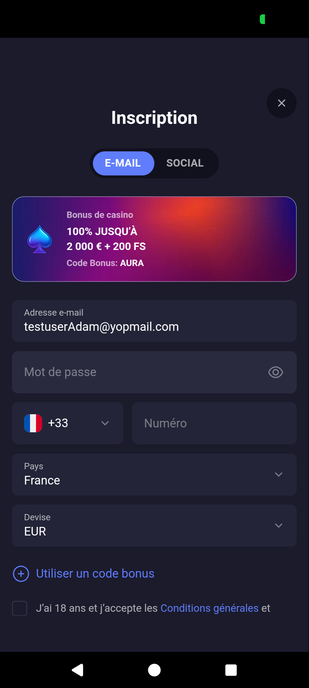
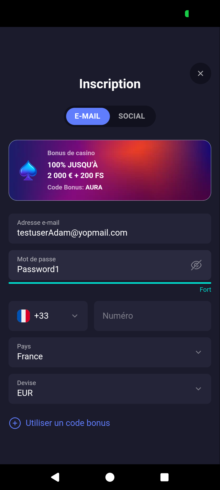
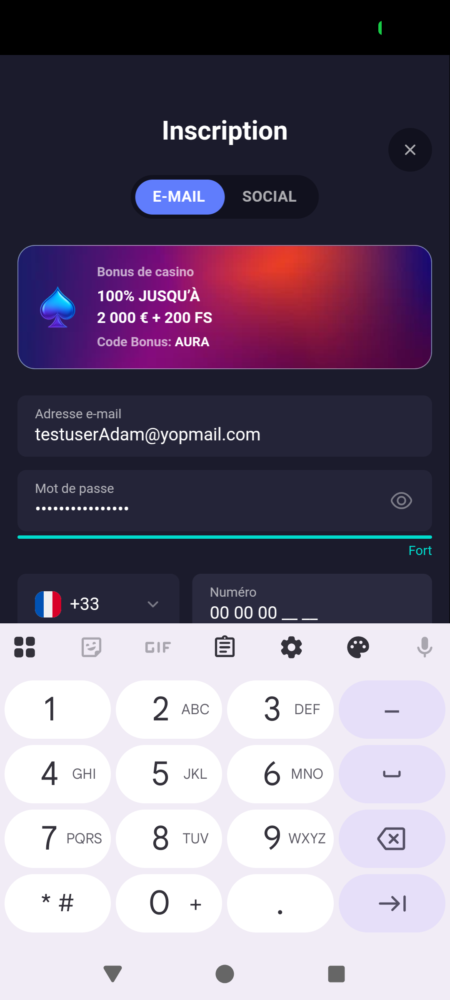
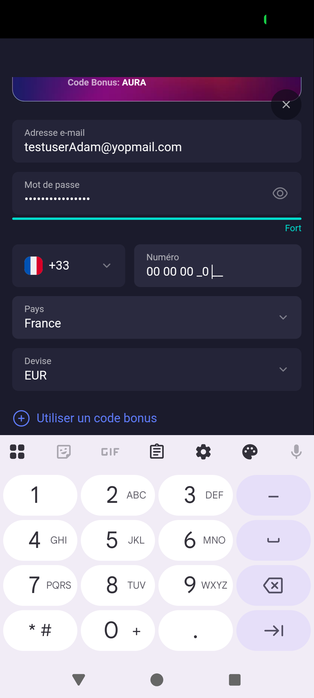
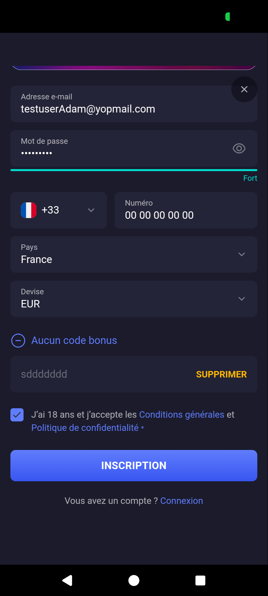
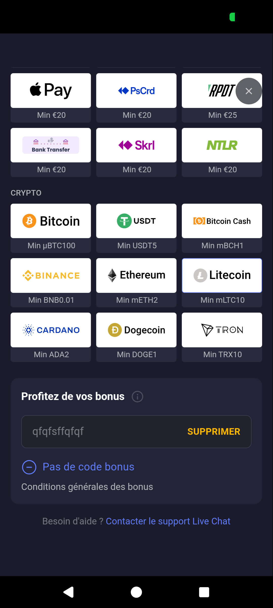
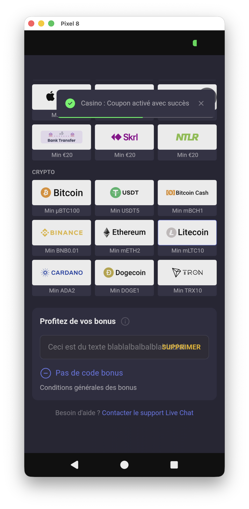
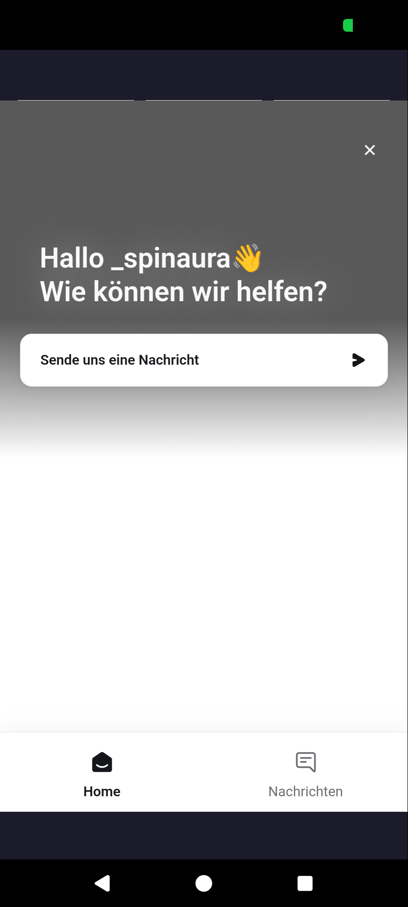

# Part 1 — Flow Analysis & UI Review: Betclic Mobile App (Android)

## 1. App Overview

- **App:** Betclic Sports (Play Store)
- **Package:** `com.bclicrisez.utility`
- **Architecture:** Hybrid app — native Android shell wrapping a `android.webkit.WebView`. All UI content is rendered as web content inside the WebView. No native Android UI components (buttons, text fields, etc.) are exposed to the accessibility/automation layer.
- **Device:** Pixel 8, Android

---

## 2. Flow Map — Registration / Onboarding

```
[App Launch]
    │
    ▼
[Homepage — Casino landing page]
    │
    ├── [CONNEXION] → Login flow (not explored)
    │
    └── [INSCRIPTION] ─────────────────────────┐
            │                                   │
            ▼                                   │
    [Registration Form — Step 1]                │
    ┌──────────────────────────┐                │
    │ - Casino bonus banner    │                │
    │ - Email                  │                │
    │ - Username               │                │
    │ - Password (+ strength)  │                │
    │ - Last name              │                │
    │ - First name             │                │
    │ - Date of birth          │                │
    │ - Phone number (guided)  │                │
    │ - [Checkboxes / CGU]     │                │
    │ - [SUBMIT]               │                │
    └──────────────────────────┘                │
            │                                   │
            ├── [X close button] ───────────────┘
            │   Returns to Homepage.            │
            │   Re-clicking INSCRIPTION         │
            │   reopens form WITH data preserved │
            │                                   │
            ├── [Validation errors] → Inline    │
            │   error messages (not explored)    │
            │                                   │
            ▼                                   │
    [Deposit page — immediate]                  │
    ┌──────────────────────────┐                │
    │ "Choisissez un mode de   │                │
    │  paiement"               │                │
    │ FIAT: Visa, Revolut,     │                │
    │   CashLib, Apple Pay,    │                │
    │   PsCrd, Bank Transfer,  │                │
    │   Skrill, NTLR           │                │
    │ CRYPTO: Bitcoin, USDT,   │                │
    │   Bitcoin Cash, Binance, │                │
    │   Ethereum, Litecoin,    │                │
    │   Cardano, Dogecoin,     │                │
    │   Tron                   │                │
    └──────────────────────────┘                │
    No welcome screen, no tutorial,             │
    no identity verification before deposit.    │
```

### Alternative Branches

| Branch | Trigger | Behavior |
|--------|---------|----------|
| Close form (X) | Tap X button on registration form | Returns to homepage; form data is preserved on re-open (within same session) |
| Kill app + reopen | Force close app and relaunch | Returns to homepage (Casino); form data is **NOT** preserved |
| Open via browser | Deep link `betclic.fr/inscription` | Opens in Chrome, not in the app; shows cookie consent popup first |

---

## 3. UI/UX Observations

### Observation 1 — Casino bonus displayed on registration page

**Severity:** Medium

The registration form prominently displays a casino bonus banner ("Bonus de casino 100% JUSQU'À 2 000€ + 200 FS — Code Bonus: AURA") in the middle of the form, between the Email/Social tabs and the input fields. For an app branded as "Betclic Sports", showing casino promotions during onboarding may:
- Confuse users expecting a sports betting registration
- Raise regulatory compliance concerns (gambling incentives during sign-up)
- Blur the line between sports betting and casino products



---

### Observation 2 — Weak password strength validation

**Severity:** High

The password field includes a real-time visual strength indicator, which is a good UX practice. However, the validation logic is too lenient: a password like `Password1` — which is one of the most common passwords found in brute-force dictionaries — is rated as **"Fort" (Strong)**. This suggests the strength algorithm only checks for basic criteria (uppercase + lowercase + digit) without verifying against common password lists or patterns. For a gambling platform handling real money, this is a security concern.



---

### Observation 3 — Phone number input with formatted placeholder guide

**Severity:** Positive

The phone number field displays a formatted placeholder (e.g., `06 XX XX XX XX`) that visually guides the user on the expected format. This is not an input mask — the user can type freely — but the placeholder clearly communicates the expected French phone number format, reducing input errors.



---

### Observation 4 — Phone field cursor positioning with pointer/mouse input

**Severity:** Low

When using a pointer device (e.g., scrcpy with mouse), the user can click between the placeholder guide characters and position the cursor at arbitrary points in the phone field. This is a minor edge case specific to non-touch input — on a real touch device, this is unlikely to cause issues.



---

### Observation 5 — Form state persistence (within session)

**Severity:** Positive

When the user closes the registration form (X button) and navigates back to it via the INSCRIPTION button, all previously entered form data is preserved. This is a good UX pattern that prevents data loss from accidental navigation.

However, after a full app kill and relaunch, the form data is **not** preserved — the user starts fresh. This is expected behavior but worth noting for the flow map.

---

### Observation 6 — Casino-first landing page for a "Sports" app

**Severity:** Medium

After launching the app (or after killing and reopening), the default landing page displays Casino content — slot games, casino promotions, "Collections", "Achat de Bonus", etc. The bottom navigation defaults to the "Casino" tab. This is inconsistent with the app name "Betclic Sports" and may confuse users who downloaded the app for sports betting.


---

### Observation 7 — WebView wrapper architecture (not native)

**Severity:** Medium

The app is not a native Android application. UI dump analysis reveals a single `android.webkit.WebView` rendering all content, with no native UI components. This has implications for:
- **Testability:** Standard Android automation tools (uiautomator, `adb input tap`) cannot interact with individual web elements. Appium with WebView context switching is required.
- **Performance:** WebView rendering may be slower than native UI, especially on lower-end devices.
- **Accessibility:** Android accessibility services cannot read individual form elements, potentially affecting users with screen readers.
- **System integration:** Deep links, notifications, and OS-level features may have limited integration.

---

### Observation 8 — Immediate deposit screen after registration (no onboarding)

**Severity:** High

After successful registration, the user is taken **directly** to a deposit/payment screen ("Dépôt — Choisissez un mode de paiement") with no intermediate step — no welcome message, no tutorial, no identity verification (KYC). The deposit page offers both FIAT (Visa, Revolut, Apple Pay, etc.) and **cryptocurrency** options (Bitcoin, USDT, Ethereum, Dogecoin, etc.). Pushing users straight to deposit without any onboarding or verification step raises:
- **Compliance concerns:** KYC should occur before allowing deposits in regulated gambling
- **UX concerns:** No guided onboarding, the user is immediately asked to spend money
- **Responsible gaming concerns:** No cooling-off period or information about responsible gambling before first deposit


---

### Observation 9 — Cryptocurrency payments on a regulated gambling platform

**Severity:** High

The deposit page offers **9 cryptocurrency options** (Bitcoin, USDT, Bitcoin Cash, Binance, Ethereum, Litecoin, Cardano, Dogecoin, Tron) alongside traditional FIAT methods. This is notable for a regulated gambling platform because:
- **AML (Anti-Money Laundering) concerns:** Cryptocurrencies are pseudo-anonymous, making transaction traceability harder — a critical requirement in regulated gambling
- **No EUR equivalent displayed:** FIAT methods all show "Min €20", but crypto minimums are displayed in their native units (µBTC100, USDT5, mETH2, BNB0.01, etc.) with no EUR conversion, making it difficult for users to understand how much they're depositing
- **Inconsistent minimum units:** Some use micro-units (µBTC, mETH, mLTC, mBCH), others use full units (ADA, DOGE, TRX, USDT) — confusing and error-prone


---

### Observation 10 — Any text accepted as valid bonus code (no validation)

**Severity:** High

When entering an invalid bonus code during registration (e.g., "sddddddd"), the field accepts it silently with no feedback. After registration, the invalid code is **carried over** to the deposit page under "Profitez de vos bonus" with an "APPLIQUER" button. Even after clicking "APPLIQUER", **any arbitrary text is accepted as a valid coupon** — the system displays a success toast: "Casino : Coupon activé avec succès". This means:
- **No server-side validation** of bonus codes — any string is accepted
- The coupon is categorized as **Casino** even though the app is branded as Sports
- At no point in the entire flow (registration → deposit → apply) does the user receive an error for an invalid code

This is both a functional bug (no validation) and a potential business impact issue (users could exploit fake bonus codes, or legitimate codes may not work correctly).






---

### Observation 11 — Bonus code field has no character limit (text overflow)

**Severity:** Medium

The bonus code input field on the deposit page has no maximum character limit. Entering a long string (e.g., "Ceci est du texte blablalbalbalblablablal") causes the text to overflow and overlap with the "APPLIQUER/SUPPRIMER" button, breaking the layout. This is both a UI bug and a potential security concern (no input length validation could enable injection of very long strings).


---

### Observation 12 — Live chat page displayed in wrong language

**Severity:** Medium

Tapping the live chat / contact link in the app opens a support page displayed in a non-French language. This is unexpected for an app targeting the French market.

**Device locale investigation (ADB dump):**
| Property | Value |
|----------|-------|
| `persist.sys.locale` | `fr-FR` (active system locale = French) |
| `system_locales` | `fr-FR,de-DE` (French primary, German secondary) |
| `ro.product.locale` | `en-US` (factory default) |

The device is correctly configured in French (`fr-FR`) as the primary language, so the app **should** be sending `Accept-Language: fr-FR` in the WebView headers. This rules out a device misconfiguration.

**UI dump analysis:** The live chat page is rendered entirely inside a `android.webkit.WebView` with `NAF="true"` (Not Accessibility Friendly) — no text content is exposed to the native accessibility layer, making it impossible to verify the displayed language via `uiautomator`. The chat service content is fully opaque to Android instrumentation tools.

**Likely root cause:** The embedded chat service (e.g., Zendesk, Intercom) either:
1. Does not read the `Accept-Language` header from the WebView request
2. Falls back to a default language (English/German) when French is not configured in their backend
3. Picks up the secondary locale (`de-DE`) if French is unavailable

**Evidence:** The chat page displays entirely in **German** — "Hallo _spinaura 👋 / Wie können wir helfen?" / "Sende uns eine Nachricht" / "Nachrichten" tab — despite the device's primary locale being `fr-FR`. The German language matches the device's **secondary locale (`de-DE`)**, confirming that the chat service is picking up the wrong locale from the `system_locales` list.

**Root cause confirmed:** The embedded chat service reads the secondary language (`de-DE`) instead of the primary (`fr-FR`) from the device's locale list, or does not support French and falls back to the next available language. This is a **configuration bug on the chat service integration**, not a device-side issue.



---

### Observation 13 — Lottery opt-in enabled by default on deposit page

**Severity:** High

After killing and reopening the app, a new section appears at the bottom of the deposit page: **"Recevoir mes billets de loterie"** with a toggle switch **enabled by default** (opt-in). The promotion shown is "Valentine's Love Lottery — €20 = 1 Billet(s)".

This raises several concerns:
- **Dark pattern (opt-out instead of opt-in):** The user is automatically enrolled in a lottery promotion without explicit consent. In regulated gambling, promotional features should require deliberate opt-in, not opt-out.
- **Dynamic content appearance:** This section was not visible during the initial registration flow — it appeared only after an app kill and reopen, suggesting either A/B testing, time-based promotions, or delayed server-side content injection.
- **Gambling pressure stacking:** Combined with the casino bonus banner (Observation 1) and the immediate deposit screen (Observation 8), the user is now exposed to three layers of gambling incentives before even making their first deposit.
- **Regulatory concern:** Auto-enrolling users in lottery-style promotions may violate responsible gaming regulations in France (ANJ guidelines).


---

### Observation 14 — CRITICAL: Fraudulent clone app on Google Play Store

**Severity:** Critical

**The app analyzed in this document is NOT the official Betclic application.** It is a fraudulent clone distributed on the Google Play Store under the name "Betclic: Sports Mood".

#### How it was discovered

During the live chat investigation (Observation 12), the chat greeted the user with **"Hallo _spinaura 👋"** — referencing SpinAura, a separate online casino operated by Tronabriz Limited (Costa Rica). This prompted a deeper investigation via ADB.

#### Evidence from ADB analysis

| Property | Value | Red flag |
|----------|-------|----------|
| **Package name** | `com.bclicrisez.utility` | Not the official Betclic package |
| **MainActivity** | `com.example.wallpaper_utility.MainActivity` | "wallpaper_utility" — disguised app identity |
| **Framework** | Flutter (Firebase, flutter plugins) | Real Betclic uses native Android + WebView |
| **Version** | `1.0.2` (versionCode 19) | Very low version for an established brand |
| **Installer** | `com.android.vending` (Google Play Store) | Distributed through official store |
| **Chat service** | Displays "SpinAura" branding | Exposes connection to another gambling operation |

#### Multiple fake Betclic apps on the Play Store

A web search revealed **multiple fraudulent Betclic apps** on the Google Play Store:

| App name | Package | Status |
|----------|---------|--------|
| "Betclic: Sports Mood" | `com.bclicrisez.utility` | **FAKE** — analyzed in this document |
| "Betclic" | `com.wilfitelared.datrixa` | **FAKE** — already removed (404) |
| Betclic Apostas e Casino (Portugal) | `sport.android.betclic.pt` | Likely official (Portuguese market) |

#### Why the real Betclic is not on the Play Store (France)

The official Betclic app for the French market is **not distributed via the Google Play Store**. French gambling regulations (ANJ — Autorité Nationale des Jeux) require operators to distribute their apps through their own websites. The official APK must be downloaded directly from `betclic.fr`. This creates an opportunity for fraudulent apps to appear on the Play Store, targeting users who search for "Betclic".

#### Security implications

- **Data harvesting:** The fake app collects personal data (email, name, phone, date of birth) through a convincing registration form
- **Password theft:** Users may enter passwords they reuse on other services
- **Financial fraud:** The deposit page with FIAT and crypto options could be used to steal payment information
- **Brand impersonation:** The app convincingly mimics Betclic's branding, making it difficult for users to distinguish from the real product

#### Action taken

The fraudulent app was **uninstalled** from the test device via ADB:
```
adb shell pm uninstall com.bclicrisez.utility → Success
```

---

## 4. Edge Cases Identified

| Edge Case | Description | Status |
|-----------|-------------|--------|
| Form persistence after kill | Data is lost after force-closing the app | Verified |
| Form persistence within session | Data is preserved when navigating away and back | Verified |
| Pointer vs touch input | Phone mask behaves differently with mouse vs touch | Verified |
| Deep link handling | `betclic.fr/inscription` opens in browser, not app | Verified |
| Cookie banner on web | Web version shows cookie consent before registration | Observed |

---

## 5. Recommendations

1. **Landing page alignment:** Consider defaulting to Sports content for an app named "Betclic Sports", or rename the app to reflect its multi-product nature.
2. **Registration bonus messaging:** Review compliance implications of showing casino bonuses during the sports app registration flow.
3. **Accessibility audit:** Since the app is WebView-based, ensure WCAG compliance of the web content for screen reader compatibility.
4. **Test automation strategy:** Use Appium with WebView context switching for E2E testing, as native Android tools cannot interact with the app's UI elements.

---

*Document generated as part of the QA Automation Assessment for Betclic.*
