# Part 1 — Flow Analysis & UI Review: Betclic Mobile App (Android)

## 1. App Overview

- **App:** Betclic Paris Sportifs & Poker (Play Store)
- **Package:** `sport.android.betclic.fr`
- **Version:** 9.10.1 (versionCode 2162298)
- **Developer:** Betclic Developer (verified)
- **Installer:** Google Play Store (`com.android.vending`)
- **Device:** Pixel 8, Android 16
- **Device locale:** `fr-FR` (primary), `de-DE` (secondary)

**Architecture (from ADB `dumpsys activity top` + `dumpsys accessibility`):**
- **UI Framework:** Jetpack Compose (native Android) — NOT a WebView wrapper
- **Navigation:** NavHostFragment (Android Navigation Component)
- **Registration flow:** Multi-step with dedicated fragments (`RegisterGenderFragment`, etc.)
- **Progress indicator:** `register_progress_header` — native progress bar across steps
- **Monitoring:** Datadog RUM integrated
- **App locale:** Forces `fr` regardless of device locale (`fr_FR,de_DE`) — good practice
- **Accessibility window title:** "Betclic" — properly set
- **Note:** `uiautomator dump` does not work reliably with Jetpack Compose — the dump either times out or returns incomplete data. `dumpsys activity top` provides the view hierarchy instead.

---

## 2. Flow Map — Registration / Onboarding

```
[App Launch]
    │
    ▼
[Registration Page + Cookie Banner (modal overlay)]
    │
    │   Background: Registration page with [Connexion] and [Quitter] in header
    │   Foreground: Cookie consent modal (must be dismissed first)
    │
    ├── [Paramétrer] → Cookie settings (3 categories)
    │       └── [Valider la sélection] ──┐
    ├── [Tout accepter] ────────────────┤
    ├── [Continuer sans accepter] ──────┤
    │                                    │
    │   ┌────────────────────────────────┘
    │   ▼
    │
[Registration Flow — Step 1: Gender]
    ┌──────────────────────────────┐
    │ Header: [Connexion] [Quitter]│
    │                              │
    │ Promo banner: "Jusqu'à 100€ │
    │ remboursés en Freebets*     │
    │ si ton 1er pari est perdant"│
    │                              │
    │ "Prêt ? Pour commencer,     │
    │  on doit t'appeler..?"      │
    │                              │
    │ [Madame]    [Monsieur]       │
    └──────────────────────────────┘
    │
    ├── [Connexion] → Login form
    │       ├── [Back button] → Homepage (sports)
    │       ├── [X close button] → Homepage (sports)
    │       └── Login flow (not explored)
    │
    ├── [Quitter] → Homepage (sports) directly
    │
    └── [Madame / Monsieur] → Next registration step
            │
            ▼
[Registration Flow — Step 2: First Name]
    ┌──────────────────────────────┐
    │ Header: [← back] [X close]  │
    │ Progress bar (early stage)   │
    │                              │
    │ "Comment t'appelles-tu ?"   │
    │ "Saisis tes informations    │
    │  comme indiqué sur ta pièce │
    │  d'identité"                │
    │                              │
    │ [1er Prénom] (text input)    │
    │ Validation: 2-50 chars      │
    │                              │
    │ [Ajouter un prénom]          │
    │ (for compound first names)   │
    │                              │
    │ [Étape suivante] (pink btn)  │
    └──────────────────────────────┘
    │
    └── Valid input → Step 3
            │
            ▼
[Registration Flow — Step 3: Last Name]
    ┌──────────────────────────────┐
    │ Header: [← back] [X close]  │
    │ Progress bar (advancing)     │
    │                              │
    │ "Merci {prénom}, quel est   │
    │  ton nom ? 😉"              │
    │                              │
    │ [Nom] (text input)           │
    │ Validation: 2-50 chars       │
    │                              │
    │ [Étape suivante] (pink btn)  │
    └──────────────────────────────┘
    │
    └── Valid input → Step 4
            │
            ▼
[Registration Flow — Step 4: Date of Birth]
    ┌──────────────────────────────┐
    │ Header: [← back] [X close]  │
    │ Progress bar (advancing)     │
    │                              │
    │ "Parfait, quelle est ta     │
    │  date de naissance ? 🎂"    │
    │                              │
    │ [JJ/MM/AAAA] (masked input)  │
    │ Auto numeric keyboard        │
    │ Auto-inserted "/" separators  │
    │                              │
    │ [Étape suivante] (pink btn)  │
    └──────────────────────────────┘
    │
    └── Valid input → Step 5
            │
            ▼
[Registration Flow — Step 5: Place of Birth]
    ┌──────────────────────────────┐
    │ Header: [← back] [X close]  │
    │ Progress bar (advancing)     │
    │                              │
    │ "Où es-tu né ?"             │
    │                              │
    │ Pays: [France] (pre-filled)  │
    │ Ville: [empty]               │
    │                              │
    │ [Étape suivante] (pink btn)  │
    └──────────────────────────────┘
    │
    ├── [X close] → Confirmation modal:
    │       "Tu es sûr ?"
    │       "Il y en a pour moins d'une minute
    │        tu veux vraiment t'arrêter là ?"
    │       [Oui] → Exit registration
    │       [Non] → Back to current step
    │
    └── Valid input → Step 6
            │
            ▼
[Registration Flow — Step 6: Identity Document (KYC)]
    ┌──────────────────────────────┐
    │ Header: [← back] [X close]  │
    │ Progress bar (~40%)          │
    │                              │
    │ "Peux-tu nous communiquer   │
    │  une pièce d'identité ?"    │
    │ "Ce sera obligatoire pour   │
    │  retirer tes gains plus     │
    │  tard."                     │
    │                              │
    │ [Carte d'identité]     →    │
    │ [Passeport]            →    │
    │ [Permis de conduire]   →    │
    │ [Titre de séjour]      →    │
    │                              │
    │ [Le faire plus tard] (skip)  │
    └──────────────────────────────┘
    │
    ├── Document selection → Document upload flow
    └── [Le faire plus tard] / [Étape suivante] → Step 7
            │
            ▼
[Registration Flow — Step 7: Username/Pseudo]
    ┌──────────────────────────────┐
    │ Header: [← back] [X close]  │
    │ Progress bar (~50%)          │
    │                              │
    │ "Choisis ton pseudo, il ne  │
    │  te quittera plus ! 🤩"    │
    │                              │
    │ [Pseudo] (text input)        │
    │ Validation: 6-20 chars       │
    │ ⚠ Permanent — cannot change  │
    │                              │
    │ [Étape suivante] (pink btn)  │
    └──────────────────────────────┘
    │
    └── Valid input → Step 8
            │
            ▼
[Registration Flow — Step 8: Password]
    ┌──────────────────────────────┐
    │ Header: [← back] [X close]  │
    │ Progress bar (~60%)          │
    │                              │
    │ "Et ton mot de passe 🔑"   │
    │                              │
    │ [Password] (masked input) 👁│
    │ ✅ Au moins une minuscule    │
    │ ✅ Au moins une majuscule    │
    │ ✅ Au moins un chiffre       │
    │ ✅ Entre 8 et 20 caractères  │
    │                              │
    │ [Étape suivante] (pink btn)  │
    └──────────────────────────────┘
    │
    └── All criteria met → Step 9
            │
            ▼
[Registration Flow — Step 9: Email]
    ┌──────────────────────────────┐
    │ Header: [← back] [X close]  │
    │ Progress bar (~70%)          │
    │                              │
    │ "Une adresse email ? ✉️"    │
    │                              │
    │ [Email] (text input)         │
    │ Format validation            │
    │                              │
    │ [Étape suivante] (pink btn)  │
    └──────────────────────────────┘
    │
    └── Valid email → Step 10
            │
            ▼
[Registration Flow — Step 10: Mobile Phone]
    ┌──────────────────────────────┐
    │ Header: [← back] [X close]  │
    │ Progress bar (~75%)          │
    │                              │
    │ "Et un numéro de mobile ?📱"│
    │ "Pour sécuriser ton compte" │
    │                              │
    │ [__ __ __ __ __] (masked)    │
    │ Numeric keyboard auto        │
    │ French format (10 digits)    │
    │                              │
    │ [Étape suivante] (pink btn)  │
    └──────────────────────────────┘
    │
    └── Valid number → Step 11
            │
            ▼
[Registration Flow — Step 11: Postal Address]
    ┌──────────────────────────────┐
    │ Header: [← back] [X close]  │
    │ Progress bar (~80%)          │
    │                              │
    │ "Quelle est ton adresse ?🏠"│
    │                              │
    │ [Adresse] (autocomplete)     │
    │ [Complément] (optional)      │
    │ [Ville + CP] (auto-filled)   │
    │                              │
    │ [Étape suivante] (red btn)   │
    └──────────────────────────────┘
    │
    └── Valid address → Step 12
            │
            ▼
[Registration Flow — Step 12: Address Confirmation]
    ┌──────────────────────────────┐
    │ Header: [← back] [X close]  │
    │ Progress bar (~85%)          │
    │                              │
    │ "Confirme ton adresse       │
    │  postale"                   │
    │                              │
    │ [Le + rapide]                │
    │ Envoyer un justificatif  →  │
    │ de domicile                  │
    │                              │
    │         — Ou —               │
    │                              │
    │ Recevoir un code par     →  │
    │ courrier (4 jours ouvrés)    │
    │                              │
    │ [Le faire plus tard] (skip)  │
    └──────────────────────────────┘
    │
    ├── Upload justificatif → Upload flow
    ├── Courrier → Step 12b
    └── [Le faire plus tard] → Next step (TBD)
            │
            ▼
[Registration Flow — Step 12b: Code par courrier — Confirmation]
    ┌──────────────────────────────┐
    │ Header: [← back]            │
    │                              │
    │ "Recevoir un code par       │
    │  courrier"                  │
    │ "Pour que tu puisses valider│
    │  ton compte Betclic, nous   │
    │  devons t'envoyer un code   │
    │  d'activation par la poste."│
    │                              │
    │ ┌────────────────────────┐  │
    │ │ test, user, adam       │  │
    │ │ ferreira               │  │
    │ │ 1 Avenue de la Porte   │  │
    │ │ de la Chapelle         │  │
    │ │ 75018 Paris            │  │
    │ │                        │  │
    │ │ [Modifier mon adresse] │  │
    │ └────────────────────────┘  │
    │                              │
    │ [Confirmer] (red btn)        │
    └──────────────────────────────┘
    │
    ├── [Confirmer] → Code request sent, back to Step 12
    │       └── Step 12 now shows "Déjà demandé" badge
    │           on "Recevoir un code par courrier"
    │           └── Re-tapping → "Code déjà demandé" modal
    │               ├── [Demander un code] → Replace previous code
    │               └── [fermer] → Dismiss modal
    │
    └── [Modifier mon adresse] → Address edit screen
            └── ⚠ BUG: [← back] goes to Step 10 (phone)
                instead of Step 12b — back stack corrupted

[Registration Flow — Step 12: "Étape suivante"]
    │
    ▼
[Registration Flow — Step 13: Final — Legal Consent & Referral]
    ┌──────────────────────────────┐
    │ Header: [← back] [X close]  │
    │ Progress bar (~95%) 🔥      │
    │                              │
    │ "Dernière étape avant de    │
    │  rejoindre la communauté    │
    │  Betclic 😎"               │
    │                              │
    │ 🟢 Age cert + CGU + Privacy │
    │ 🟢 Marketing opt-in         │
    │    (enabled by default)      │
    │                              │
    │ Legal disclaimer (AML,       │
    │ fraud, responsible gaming)   │
    │                              │
    │ "J'ai un parrain ou un      │
    │  code promo"                │
    │ [🤝 J'ai un parrain]    →  │
    │ [J'ai un code promo]    →  │
    │                              │
    │ [Finaliser mon inscription]  │
    │ (red button)                 │
    └──────────────────────────────┘
    │
    └── [Finaliser mon inscription] → Bottom sheet: "Inscription réussie !"
            │
            ▼
[Registration Flow — Success: Bottom Sheet]
    ┌──────────────────────────────┐
    │ (dark overlay on Step 13)    │
    │                              │
    │ ┌──────────────────────────┐ │
    │ │ ─── (drag handle)        │ │
    │ │                          │ │
    │ │    ✅ (green checkmark)  │ │
    │ │                          │ │
    │ │ "Inscription réussie !" │ │
    │ │ "Bien joué ! Définis tes│ │
    │ │  limites pour pouvoir   │ │
    │ │  jouer !"               │ │
    │ │                          │ │
    │ │ [Continuer] (red btn)    │ │
    │ └──────────────────────────┘ │
    └──────────────────────────────┘
    │
    └── [Continuer] → Responsible gaming profiling
            │
            ▼
[Post-Registration — Responsible Gaming Profiling]
    │   "Quel type de joueur es-tu ?" (not fully explored)
    │
    ⚠ Session timeout observed here — redirected to login screen
```

**Note:** The app launches directly on the **registration page**, not a homepage. The cookie banner appears as a modal overlay on top of this page. "Connexion" and "Quitter" are part of the registration page header (visible behind the modal) and become interactive only after dismissing the cookie banner. Both "Connexion" (via back/X) and "Quitter" lead to the **sports homepage** — confirming the app defaults to sports content.

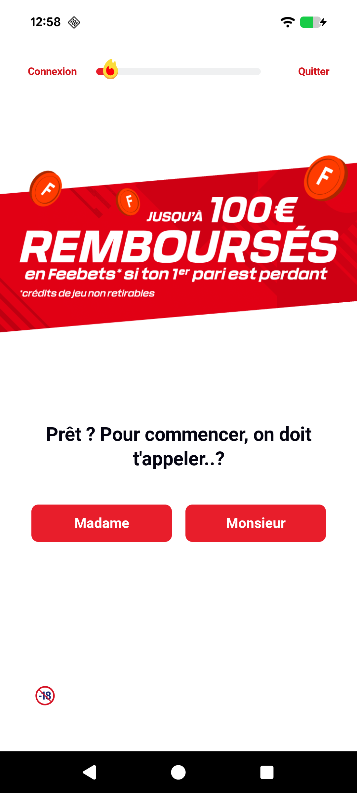

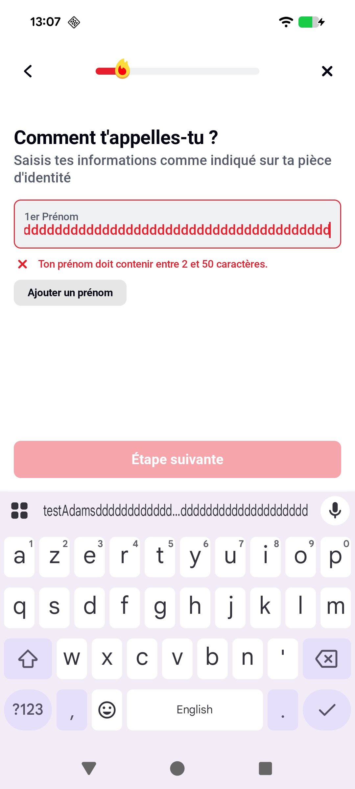

---

## 3. UI/UX Observations

### Observation 1 — RGPD cookie consent banner on first launch

**Severity:** Positive

On first launch (or after clearing app data), a proper RGPD cookie consent banner is displayed with three clear options:
- **"Paramétrer"** — customize cookie preferences
- **"Tout accepter"** (red button) — accept all cookies
- **"Continuer sans accepter"** — continue without accepting

The banner clearly states what cookies are used for: performance, optimized/secure experience, and personalized content/offers. It also reassures the user that preferences can be changed at any time. This is compliant with RGPD requirements and provides genuine user choice (not a dark pattern).

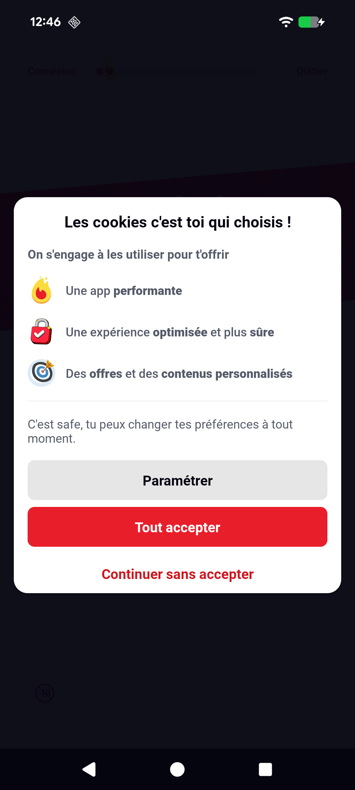

Tapping "Paramétrer" opens a detailed cookie management screen with three categories:
- **Essentiel** — always active, cannot be disabled (correct behavior)
- **Optimisation de la publicité** — disabled by default (opt-in)
- **Mesure d'audience** — disabled by default (opt-in)

Only essential cookies are enabled by default, which is **fully RGPD-compliant** (privacy by default). A link to the "Politique de vie privée" is also provided.

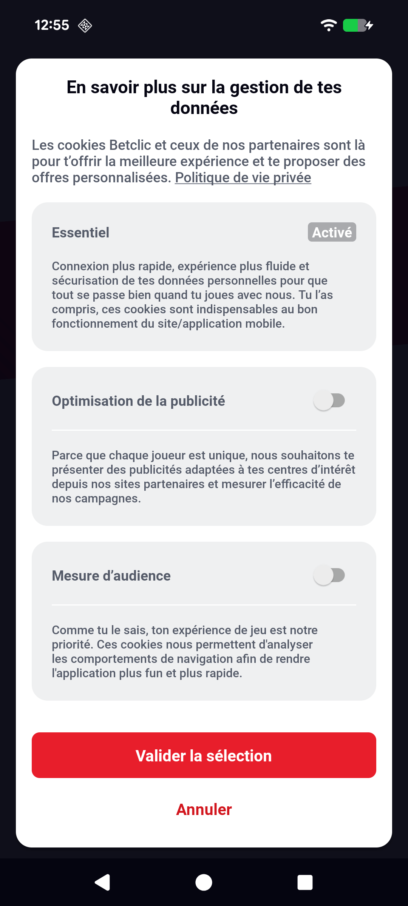

**Notable:** The cookie implementation is remarkably concise — only 3 categories (essential, advertising, audience measurement) instead of the typical 10+ categories seen on many gambling/betting platforms. This simplicity makes the consent process genuinely user-friendly rather than overwhelming users into clicking "Accept all" out of fatigue (a common dark pattern). The descriptions are written in plain, informal French ("Tu l'as compris...", "Comme tu le sais...") which aligns with Betclic's brand tone.

---

### Observation 2 — First name input validation (Step 2)

**Severity:** Positive

The first name field ("1er Prénom") has proper client-side validation:
- **Length constraint:** 2 to 50 characters — error message displayed in red: *"Ton prénom doit contenir entre 2 et 50 caractères."*
- **Visual feedback:** The input field border turns red, with a clear error icon (X) and message below
- **Identity compliance:** The subtitle explicitly asks the user to enter their name "comme indiqué sur ta pièce d'identité" (as shown on their ID document) — important for KYC compliance in regulated gambling
- **Compound names support:** An "Ajouter un prénom" button allows adding additional first names, accommodating French compound names (e.g., Jean-Pierre, Marie-Claire)


---

## 4. Edge Cases Identified

### Edge Case 1 — First name exceeding 50 characters

**Input:** 40+ "d" characters in the first name field
**Result:** Immediate client-side validation error — *"Ton prénom doit contenir entre 2 et 50 caractères."*
**Behavior:** The field border turns red, error is displayed below the input. The "Étape suivante" button remains visible (should verify if it's actually disabled or if it blocks submission server-side).

### Edge Case 2 — Multiple first names with invalid input

**Input:** Two first name fields both filled with 50+ character strings
**Result:** Both fields show the same validation error independently — *"Ton prénom doit contenir entre 2 et 50 caractères."*
**Observations:**
- The second "Prénom 2" field has an **X button** to remove it, while "1er Prénom" does not (it's mandatory)
- The **"Ajouter un prénom"** button remains visible even with 2 fields — could potentially add more (not tested)
- The **"Étape suivante"** button appears visually active (pink) despite both fields having validation errors — potential UX concern (button should appear disabled to set correct user expectations)

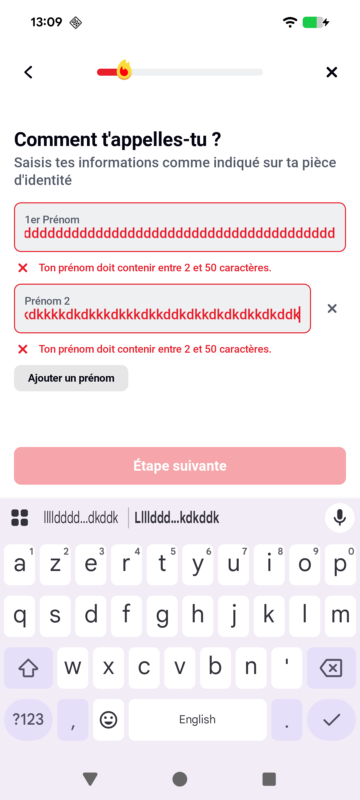

### Edge Case 3 — Maximum number of first names (5)

**Action:** Repeatedly tapped "Ajouter un prénom" until the button disappeared
**Result:** The app allows a **maximum of 5 first names** (1er Prénom + Prénom 2 through Prénom 5). The "Ajouter un prénom" button disappears after reaching the limit.
**Observations:**
- All 5 fields enforce the same validation rules (2-50 characters)
- Only the **last added field** (Prénom 5) shows the **X removal button** — deletion follows a LIFO (last in, first out) pattern, meaning you must remove fields from the bottom up
- The "Étape suivante" button appears slightly faded/disabled when all fields have errors — better UX feedback than with fewer fields
- **Limit of 5 is reasonable** for French civil identity (birth certificates can list multiple first names)

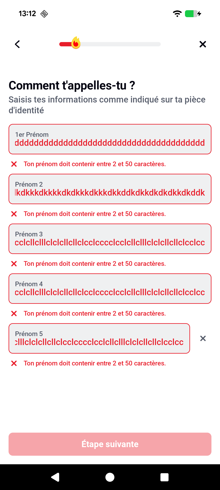

### Edge Case 4 — Last name exceeding 50 characters (Step 3)

**Input:** "ferreira" repeated to exceed 50 characters
**Result:** Same validation as first name — *"Ton nom doit contenir entre 2 et 50 caractères."*
**Observations:**
- The title dynamically includes the first name from the previous step: *"Merci test, quel est ton nom ? 😉"* — nice personalization touch that confirms the previous input was saved
- Only one field for last name (no "Ajouter un nom" option — unlike first names, which is correct for French civil identity)
- Same validation rules as first name (2-50 characters)

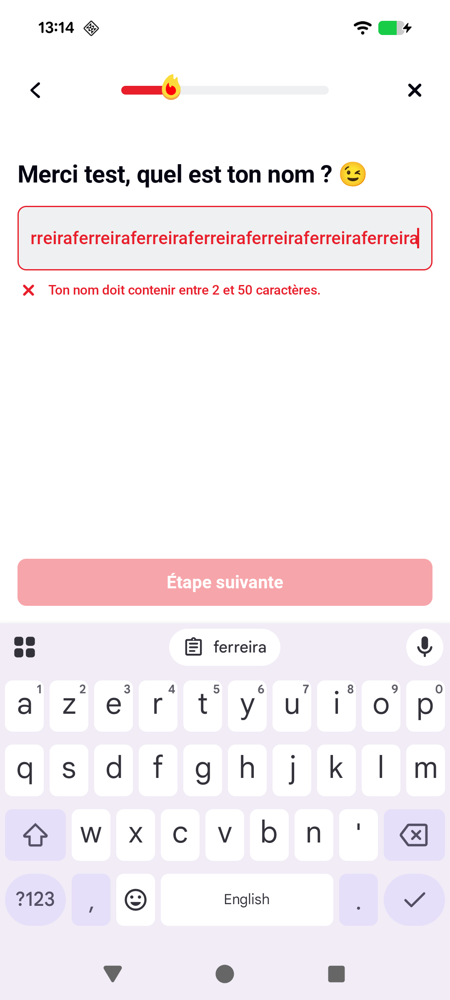

### Edge Case 5 — Date of birth input (Step 4)

**Screen:** "Parfait, quelle est ta date de naissance ? 🎂"
**Observations:**
- Masked input format `JJ/MM/AAAA` with auto-inserted `/` separators — user only types digits
- Keyboard automatically switches to **numeric mode** — good UX, prevents invalid character input
- **Key test cases to explore:** invalid dates (31/02), underage users (<18 — critical for regulated gambling/KYC), future dates, very old dates

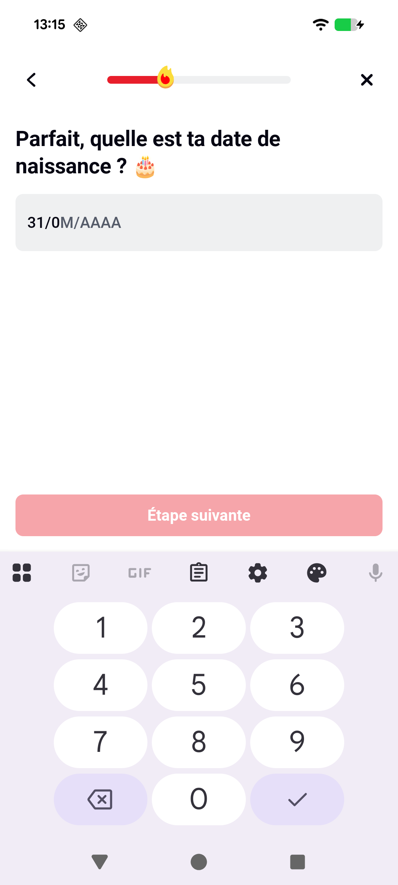

### Edge Case 6 — Underage user blocked at registration (Step 4)

**Input:** 01/01/2010 (user would be 15-16 years old)
**Result:** Registration blocked with a detailed warning message:
> *"Désolé, Il va falloir attendre tes 18 ans pour parier 🔞 Pour information si tu rentres de fausses informations lors de ton inscription, ou que tu utilises l'identité d'un tiers, ton compte sera clôturé et ton argent sera bloqué."*

**Severity:** Positive — Critical compliance requirement

**Analysis:**
- **ANJ compliance** (Autorité Nationale des Jeux): French law requires age verification for online gambling — client-side blocking is the first line of defense
- **Fraud deterrent:** The message explicitly warns about account closure and fund blocking if false information or third-party identity is used
- **🔞 emoji** reinforces the age restriction visually
- The field turns red with the same error pattern as other validation errors
- The "Étape suivante" button remains visible but appears disabled (faded pink)

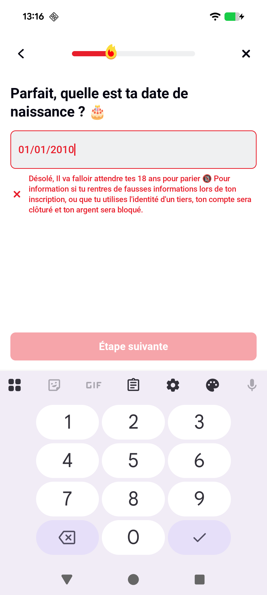

### Edge Case 7 — Quit confirmation modal during registration

**Action:** Tapped the X (close) button in the header during Step 5 (place of birth)
**Result:** A confirmation modal appears instead of immediately exiting:
> *"Tu es sûr ? Il y en a pour moins d'une minute tu veux vraiment t'arrêter là ?"*
- **[Oui]** (red button) — exit registration
- **[Non]** (red text) — return to current step

**Severity:** Positive — Good UX practice
- Prevents accidental abandonment of a multi-step flow
- Reassuring message ("less than a minute") encourages the user to complete registration
- The background is dimmed (dark overlay) to focus attention on the modal

**Also visible:** Step 5 "Où es-tu né ?" with **Pays** pre-filled as "France" and **Ville** empty — confirming the birthdate step was passed successfully.

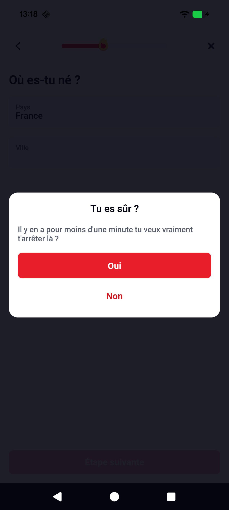

### Edge Case 8 — Invalid country in birthplace (Step 5)

**Input:** Replaced pre-filled "France" with "BlablaBlaBla" in the Pays field
**Result:** The field border turns red and text displays in red — the value is rejected.
**Observations:**
- The Pays field is a **free text input** (not a dropdown/picker), allowing any text to be typed
- Validation correctly rejects non-existent countries
- **No explicit error message** is displayed below the field — only the red border/text indicate the error. This is a **minor UX inconsistency** compared to the name fields which display clear error messages like "Ton prénom doit contenir entre 2 et 50 caractères"
- The **Ville field disappears** when the country is invalid — it appears to be conditionally displayed only when a valid country is selected
- **Recommendation:** Add an explicit error message (e.g., *"Sélectionne un pays valide"*) for consistency with other form fields

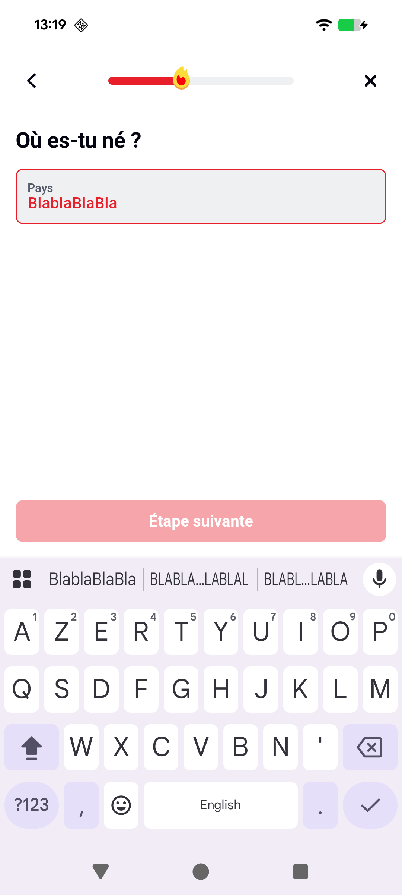

### Edge Case 9 — No character limit on country field (Step 5)

**Input:** Very long random string in the Pays field (60+ characters)
**Result:** The field accepts unlimited text input with no character limit enforced. The text overflows the visible field area.
**Severity:** Cosmetic / Low

**Analysis:**
- The first name and last name fields enforce a **2-50 character limit**, but the country field has **no visible `maxLength` restriction**
- However, the field **blocks submission** — the "Étape suivante" button does not proceed with invalid input, so there is **no risk of sending oversized payloads** to the server
- This is purely a **cosmetic/UX issue** — the user can type endlessly but it has no functional impact
- **Recommendation:** Add a `maxLength` constraint for visual consistency and to prevent unnecessary typing

**Update:** The field is actually a **searchable autocomplete** — typing a valid country name (e.g., "France") triggers a dropdown suggestion with the country flag 🇫🇷. The user must select from the suggestions for the input to be accepted. This is a good UX pattern, but the `maxLength` issue still applies to the raw text input before selection.

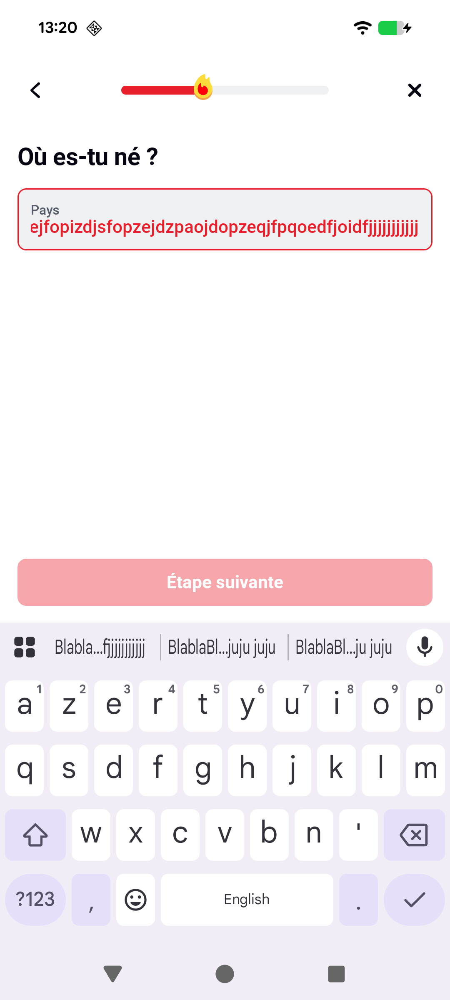
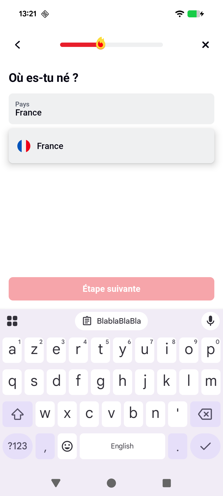

### Edge Case 10 — City autocomplete with postal codes (Step 5)

**Input:** "Paris" in the Ville field (with France selected as country)
**Result:** Autocomplete dropdown shows French cities with postal codes:
- Paris-l'Hôpital 71150
- Paris 75000
- Paris 1er Arrondissement 75001

**Observations:**
- Same searchable autocomplete pattern as the country field — consistent UX
- Suggestions include **postal codes** for precision — useful for KYC/identity verification
- Granularity goes down to **arrondissement** level for Paris — good detail for regulated gambling compliance
- The Ville field only appears when a valid country is selected (conditional display confirmed)


### Observation 3 — Identity document verification step (KYC, Step 6)

**Severity:** Positive

The registration flow includes an identity verification step offering 4 document types: Carte d'identité, Passeport, Permis de conduire, Titre de séjour. Each option has a distinct icon and a chevron (→) indicating navigation to the next screen.

**Key points:**
- **Skippable:** The "Le faire plus tard" link at the bottom allows users to defer verification — this is ANJ-compliant (KYC is mandatory for withdrawals, not necessarily at registration)
- **Transparency:** The subtitle *"Ce sera obligatoire pour retirer tes gains plus tard"* clearly communicates that verification will be required eventually
- **Titre de séjour** option shows inclusivity for non-French nationals with a residence permit
- **4 document types** cover the standard French identity document landscape

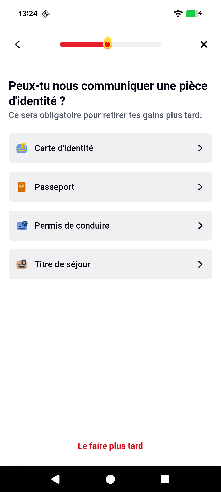

### Edge Case 11 — Submitting a second identity document type after the first

**Action:** Submitted fake images via "Carte d'identité", then went back and tapped "Passeport"
**Result:** A confirmation modal appears:
> *"Pièce d'identité déjà transmise — Tu nous as déjà envoyé une pièce d'identité. En envoyant une nouvelle, nous remplacerons l'ancienne pièce."*

**Observations:**
- **"Déjà transmis"** green badge appears on the Carte d'identité option — clear status feedback
- The app enforces a **single active document** policy — submitting a new one replaces the previous
- **[Envoyer une nouvelle pièce]** (red button) allows replacement, **[Fermer]** cancels
- **No client-side image validation** was performed on the fake images — verification likely happens server-side (async KYC review)
- Good UX: the user is clearly informed about the replacement before it happens (no silent overwrite)

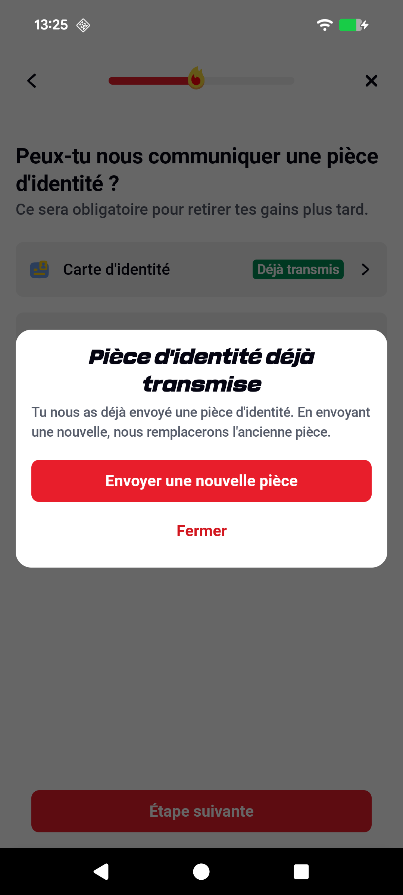

### Edge Case 12 — Pseudo too short (Step 7)

**Input:** "Fer" (3 characters)
**Result:** Validation error — *"Saisis un pseudo d'au moins 6 caractères et 20 caractères maximum"*
**Observations:**
- Different validation range (6-20) compared to name fields (2-50) — appropriate for a username
- The title warns the pseudo is **permanent**: "il ne te quittera plus !" — no future modification possible
- Good that the error message states both min and max in one message (unlike name fields which only mention the violated constraint)

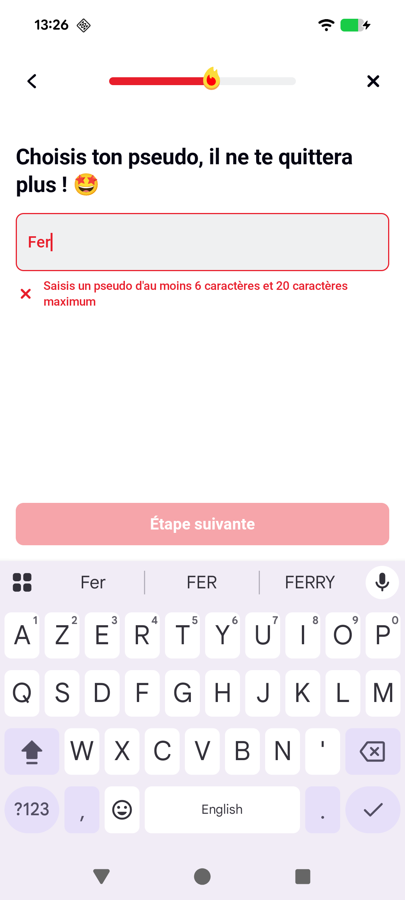

### Observation 4 — Password validation with real-time checklist (Step 8)

**Severity:** Positive (with minor concern)

The password field displays a **real-time validation checklist** with 4 criteria that turn green individually as they are met:
- At least one lowercase letter
- At least one uppercase letter
- At least one digit
- Between 8 and 20 characters

**Positive:** Excellent UX — users see exactly what's missing in real-time. The show/hide toggle (eye icon) is also present.

**Minor concern:** No special character requirement, no password strength meter, and no dictionary/common password check. "Password1" is accepted despite being an extremely common weak password. For a financial/gambling platform handling real money, a stricter policy or at least a strength indicator would be recommended.

**UX inconsistency:** When a previously validated criterion becomes unmet again (e.g., removing the digit from "Password1" → "Password"), the checkmark simply turns **grey** instead of **red**. This is inconsistent with the rest of the form where invalid fields are highlighted in red. A criterion that was green and reverts should turn red to clearly signal the regression to the user.

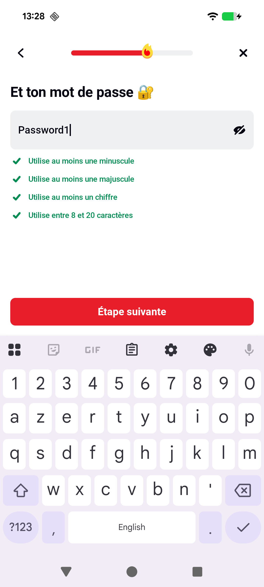

### Edge Case 13 — Invalid email format (Step 9)

**Input:** "testuseradamyopmail.com" (missing @)
**Result:** Validation error — *"Le format de l'adresse mail saisie est incorrect"*
**Observations:**
- Client-side email format validation works correctly
- The keyboard is in **standard text mode** instead of email mode (`inputType="textEmailAddress"`) — missing the dedicated @ and .com keys. This is a minor UX issue; an email-optimized keyboard would reduce friction
- Error display is consistent with other fields (red border + error message below)

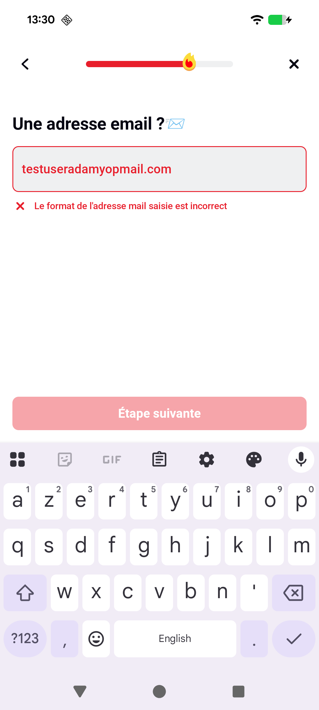

### Edge Case 14 — Invalid phone number (Step 10)

**Input:** "00 00 00" (incomplete, invalid number)
**Result:** Error message — *"Ça ce n'est pas un numéro de mobile 🤔"*
**Observations:**
- Masked input format `__ __ __ __ __` with auto-spacing — French 10-digit format
- Numeric keyboard auto-displayed — good UX
- Subtitle "Pour sécuriser ton compte" explains why the phone is needed (likely for 2FA)
- Fun, informal error message with 🤔 emoji — consistent with brand tone throughout the flow


### Observation 5 — Address autocomplete with auto-filled city (Step 11)

**Severity:** Positive

The address step features a smart autocomplete:
- Typing an address triggers suggestions (likely using an address API like Google Places or La Poste)
- Selecting an address **auto-fills the Ville + code postal** field (e.g., "Paris 75018")
- A "Complément" field is available for additional info (apartment number, building, etc.) — optional
- The "Étape suivante" button turns **fully red** (active) once required fields are filled — first time we see this strong red instead of pink

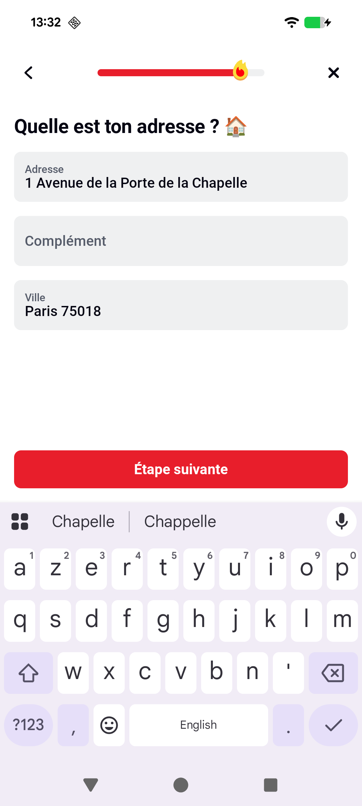

### Edge Case 15 — Address complement exceeding 50 characters (Step 11)

**Input:** 50+ "o" characters in the Complément field
**Result:** Validation error — *"Ton complément d'adresse ne peut pas dépasser 50 caractères"*
**Observations:**
- The complement field enforces a **max 50 characters** limit — consistent with name fields
- The address field is also an **autocomplete** (like country and city in step 5)
- Even though the user can type freely, **submission is blocked** with invalid data — no risk of sending oversized payloads to the server

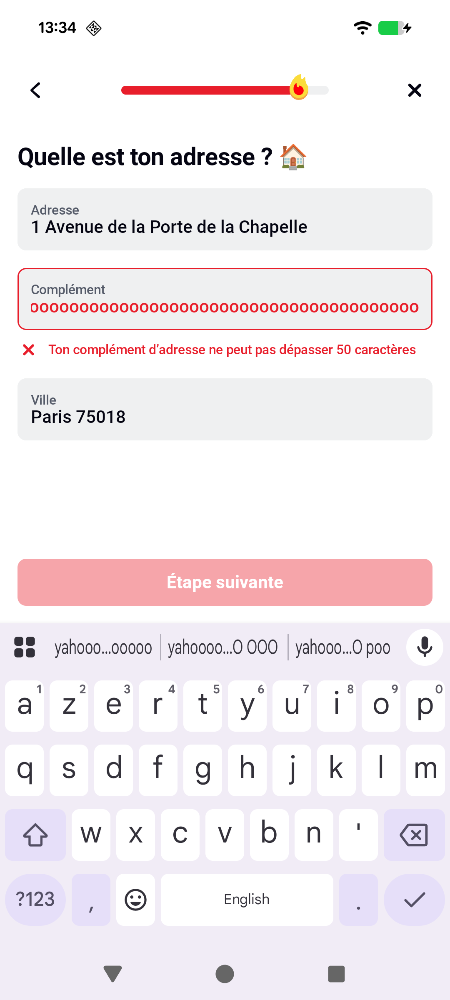

### Observation 6 — Address confirmation with dual verification methods (Step 12)

**Severity:** Positive

Two methods for address verification:
1. **Upload a proof of address** ("justificatif de domicile") — tagged "Le + rapide" (green badge) — account validated quickly
2. **Receive a code by mail** — physical letter sent within 4 business days

Both methods can be **deferred** via "Le faire plus tard" at the bottom.

**Analysis:**
- Offering both digital and physical verification improves **accessibility** (not everyone has a digital proof readily available)
- The "Le + rapide" nudge is an effective UX pattern to steer users toward the faster option without removing choice
- Skippable like the identity document step — allows users to start using the app sooner (regulatory KYC can be completed before first withdrawal)

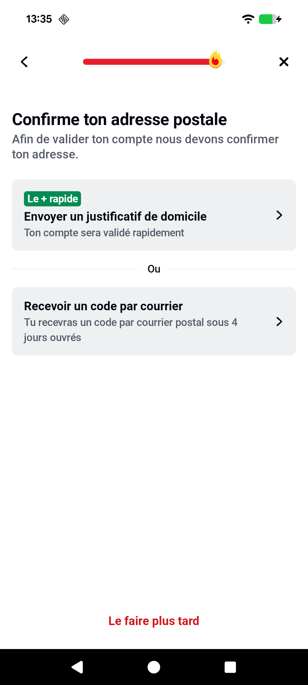

### Observation 7 — Code par courrier: address recap and confirmation (Step 12b)

**Severity:** Positive (with minor concern)

After selecting "Recevoir un code par courrier", the app displays a confirmation screen with:
- Clear explanation: *"Pour que tu puisses valider ton compte Betclic, nous devons t'envoyer un code d'activation par la poste."*
- A **recap card** showing the full postal address entered in Step 11
- A **"Modifier mon adresse"** link (blue text) to correct the address without navigating back manually
- A **"Confirmer"** button (red) to trigger the postal code request

**Minor concern — Name formatting:** The recap shows "test, user, adam ferreira" — the format appears to be `prénom2, prénom1, nom` separated by commas. This is unusual for a postal address display. Expected format would be "Test User Adam Ferreira" or similar. This could be a **formatting bug** or just an internal display choice, but it may cause confusion if the actual letter envelope uses this format.

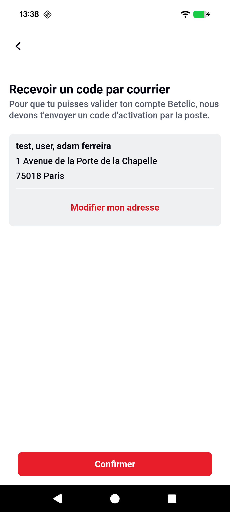

### Edge Case 16 — "Déjà demandé" badge after code request (Step 12)

**Action:** Confirmed the postal code request, then navigated back to Step 12
**Result:** The "Recevoir un code par courrier" option now displays a **green "Déjà demandé" badge** — same visual pattern as the "Déjà transmis" badge on identity documents (Edge Case 11).

**Observations:**
- **Consistent UX pattern** — green badge for "already submitted" actions across the entire registration flow (identity documents and postal code)
- The **"Le faire plus tard"** link has disappeared — logically, since a method was already chosen
- The **"Étape suivante"** button remains active — registration can continue without waiting for the code
- The "Envoyer un justificatif de domicile" option remains available as an alternative

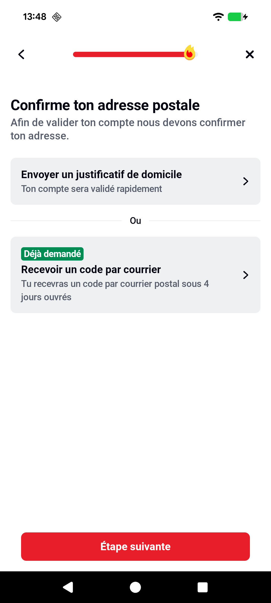

### Edge Case 17 — Re-requesting a postal code (Step 12)

**Action:** Tapped "Recevoir un code par courrier" again after it was already requested
**Result:** A confirmation modal appears:
> *"Code déjà demandé — Ta demande a déjà été prise en compte. En faisant une nouvelle demande, nous remplacerons l'ancienne par celle-ci."*
- **[Demander un code]** (red button) — sends a new code, replacing the previous one
- **[fermer]** (red text) — dismiss modal

**Observations:**
- **Same pattern as identity document replacement** (Edge Case 11) — the app always warns before replacing a previous submission. Excellent consistency.
- **Single active code policy** — "nous remplacerons l'ancienne par celle-ci" means only one code is valid at a time. Good security practice (invalidates the previous code).
- **No visible rate limiting** — the user can potentially spam code requests. A server-side rate limit should exist (e.g., max 3 requests per hour) to prevent abuse/postal spam.
- **Minor UX inconsistency:** "fermer" is lowercase here, while "Fermer" was capitalized in the identity document modal (Edge Case 11). Cosmetic bug.

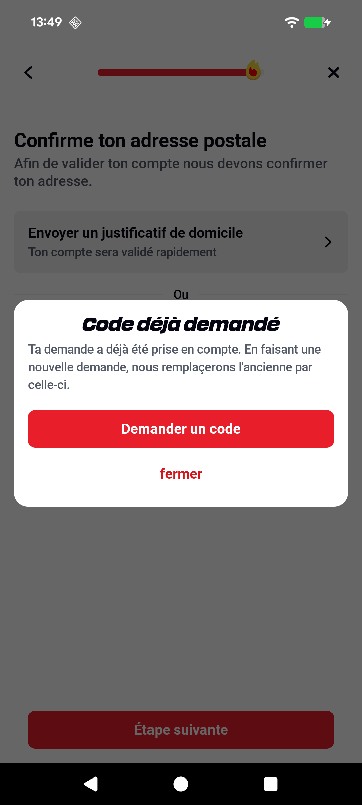

### Edge Case 18 — Back stack inconsistency on non-standard path (Step 12b)

**Severity:** Low — Minor UX inconsistency on edge path

**Steps to reproduce (non-standard path):**
1. Complete registration up to Step 12 (address confirmation)
2. Select "Recevoir un code par courrier" → Step 12b appears
3. Tap "Confirmer" → code is requested, returns to Step 12
4. Tap "Recevoir un code par courrier" again → "Code déjà demandé" modal
5. Choose "Demander un code" → returns to Step 12b
6. Tap **"Modifier mon adresse"** → goes to address modification screen (expected)
7. Tap **← back** from the address modification screen

**Expected result:** Return to Step 12b (code par courrier confirmation)
**Actual result:** Returns to **Step 10 (phone number)** — skipping Steps 11, 12, and 12b entirely

**Note:** This only occurs on a non-standard path — the user must re-request a code and then try to modify the address, which is an unlikely real-world scenario. The happy path (confirm code → étape suivante) works correctly. The back stack is properly managed on the main registration flow; this inconsistency only surfaces when chaining secondary actions (re-request + modify) within the address confirmation sub-flow.

### Observation 8 — Final registration step: legal consent and referral (Step 13)

**Severity:** Positive

The final screen before account creation ("Dernière étape avant de rejoindre la communauté Betclic 😎") includes:

- **Age certification toggle** (pre-enabled, green): *"Je certifie avoir plus de 18 ans. J'ai lu et j'accepte les Conditions Générales et la Politique Vie Privée et Cookies."* — with clickable links to legal documents
- **Marketing opt-in toggle** (enabled by default): *"J'accepte de recevoir les offres spéciales et informations de la part de Betclic"*
- **Legal disclaimer text:** Mentions data processing for fraud prevention, anti-money laundering, counter-terrorism financing, and responsible gaming obligations. Links to "Politique Vie Privée et Cookies."
- **Referral section:** "J'ai un parrain ou un code promo" with two expandable options: "J'ai un parrain" (🤝) and "J'ai un code promo"
- **"Finaliser mon inscription"** — red button at the bottom to complete registration

**Key observations:**
- Progress bar is nearly complete (~95%) with 🔥 icon
- The age certification links (Conditions Générales, Politique Vie Privée) are **clickable** — ANJ compliance requires these to be accessible before consent
- Marketing opt-in is **enabled by default** — this is a common but debatable practice under RGPD. Strictly speaking, RGPD requires opt-in to be **explicit** (not pre-checked). However, this may be acceptable if the toggle is clearly visible and easily disabled.
- The legal text is small but readable — mentions all required regulatory topics (fraud, AML, terrorism financing, responsible gaming)

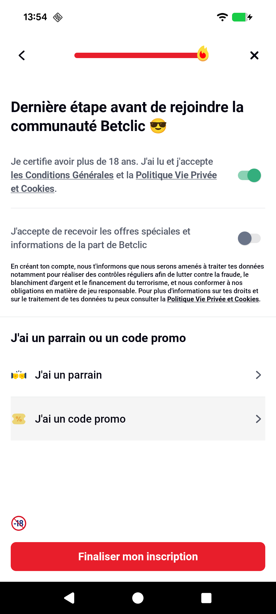

### Observation 9 — Registration success bottom sheet with responsible gaming prompt

**Severity:** Positive

After tapping "Finaliser mon inscription", a **bottom sheet** slides up over the dimmed Step 13 screen:
- **Green checkmark icon** (animated, with dashed circle border)
- **"Inscription réussie !"** — bold confirmation title
- **"Bien joué ! Définis tes limites pour pouvoir jouer !"** — immediately prompts the user to set responsible gaming limits
- **[Continuer]** — red button to proceed

**Key observations:**
- **Bottom sheet pattern** (not a full-screen transition) — lightweight, celebratory UX moment. The drag handle at the top confirms it's a standard Material Design bottom sheet.
- **Responsible gaming nudge immediately at success** — the very first message after account creation tells the user to set betting limits. This is excellent **ANJ compliance** — French regulation requires operators to promote responsible gaming tools prominently.
- **Marketing toggle was disabled** (grey, off) on the background Step 13 — confirming the toggle works and the user opted out of marketing communications.
- **Background dimmed** with dark overlay — focuses attention on the success message.
- **Red/white confetti stripes** visible on the left edge — celebratory visual touch.

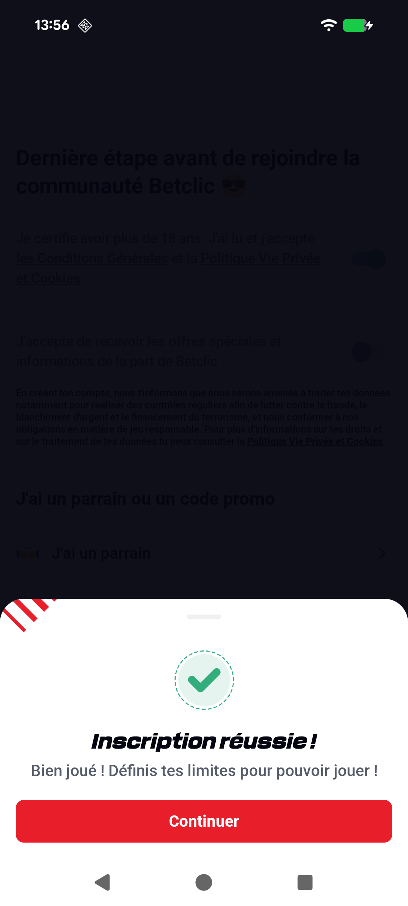

### Edge Case 19 — Session timeout during post-registration flow

**Severity:** Medium — UX concern

**Context:** After completing registration and reaching the "Quel type de joueur es-tu ?" responsible gaming profiling screen, the session expired and the user was redirected to the login screen.

**Observations:**
- The login screen shows "Email ou pseudo" pre-filled with "testuseradam" and "Password1" — credentials from the just-created account
- The keyboard is open, suggesting the app is ready for re-authentication
- **"Mot de passe oublié ?"** and **"Inscris-toi"** links available
- The **X close button** (top-left) suggests this is a modal login overlay on the main app

**Concerns:**
- **Session duration seems short** — the registration flow took ~20 minutes (13:38 to 13:57 based on timestamps), and the session expired during the mandatory post-registration flow. The token TTL may be too aggressive for a multi-step onboarding process.
- **No warning before disconnection** — the user was abruptly redirected without a "your session is about to expire" notice. A countdown or session extension prompt would improve UX.
- **Post-registration flow interrupted** — the responsible gaming profiling is an ANJ regulatory requirement. If the session expires before the user completes it, the app should **resume the flow after re-login**, not drop the user to the homepage.
- **Password visible in plain text** — "Password1" is shown in the password field (though masked with the eye icon available). This may be auto-fill behavior.

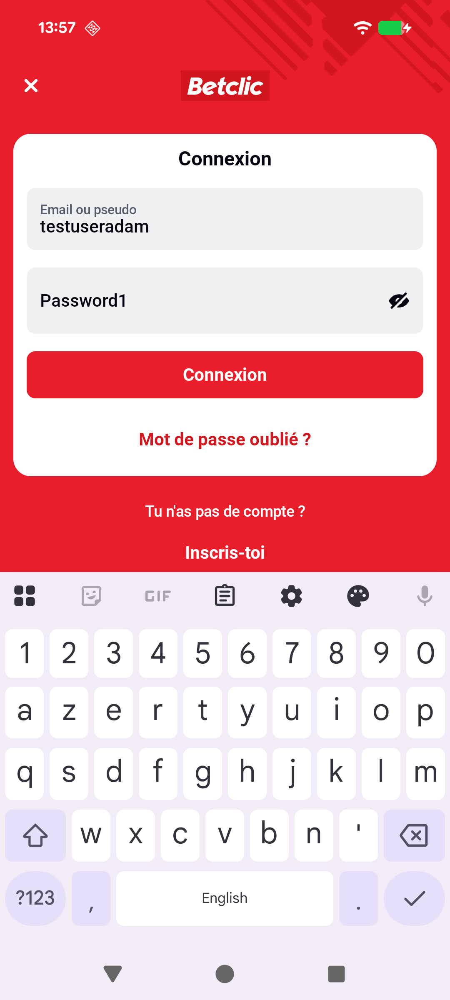

### Edge Case 20 — Cannot log in after session timeout post-registration

**Severity:** High — Potential blocker

**Steps to reproduce:**
1. Complete full registration flow (Steps 1-13)
2. Reach "Inscription réussie !" bottom sheet → tap "Continuer"
3. Arrive at responsible gaming profiling screen ("Quel type de joueur es-tu ?")
4. Wait for session to expire (~20 minutes of total flow time)
5. Get redirected to login screen
6. Enter credentials: `testuseradam@yopmail.com` / `Password1`
7. Tap "Connexion"

**Expected result:** Successful login, resume post-registration flow
**Actual result:** Error modal: *"Attention — Une erreur s'est produite lors de la connexion"* with only an "OK" button to dismiss.

**Analysis:**
- The **account was just created** moments before — credentials should be valid
- The error message is **generic** — no indication whether it's wrong credentials, account locked, server error, or account pending validation
- Possible causes:
  - **Account not fully activated** — the registration flow was interrupted before completing the responsible gaming profiling (which may be a required server-side step to finalize the account)
  - **Email verification required** — the account may need email confirmation before login is allowed (but no email verification step was shown during registration)
  - **Server-side issue** — transient error unrelated to the account state
- The **password is visible in plain text** ("Password1") in the password field — the eye icon shows it was toggled to visible. This is a minor security concern on the login screen.
- The **-18 badge** is visible in the bottom-right corner — regulatory ANJ branding.
- **No actionable guidance** for the user — the error doesn't say what to do next (check email? try again later? contact support?)

**Recommendation:** The error message should be more specific, or at minimum provide a "Réessayer" button and/or a link to customer support. If the account requires finalization, the app should clearly communicate this: *"Ton compte est en cours d'activation, réessaie dans quelques minutes."*

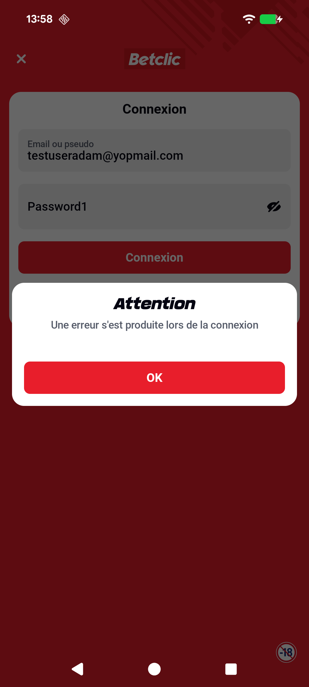

### Edge Case 21 — Account suspended after fake KYC document submission (explains Edge Case 20)

**Severity:** Positive — KYC fraud detection pipeline working correctly

**Discovery:** After failing to log in (Edge Case 20), checking the registration email (`testuseradam@yopmail.com`) revealed the full chain of events:

**Email timeline (from Betclic `info@emails.betclic.fr`):**

| Time  | Subject | Analysis |
|-------|---------|----------|
| 13:55 | "Prêt à vibrer sur Betclic ? 🤩" | Welcome email — account created successfully |
| 13:55 | "Un document a été refusé ⚠" | Fake ID document detected and rejected |
| 13:57 | "Ton compte Betclic est suspendu 🚫" | Account suspended |
| 13:58 | "Ton compte Betclic est suspendu 🚫" | Duplicate suspension notification (x2) |

**Suspension email content:**
> *"Nous vous informons que dans le cadre de nos procédures de sécurité et en accord avec la Réglementation, votre compte a été suspendu afin d'effectuer des vérifications supplémentaires."*

Key points from the email:
- **Funds and bets preserved** during verification — *"Soyez rassuré, vos fonds et paris en cours sont conservés sur votre compte pendant toute la durée de ces vérifications."*
- **Additional documents may be requested** via a follow-up email
- **30-day deadline** to respond — *"Sans retour de votre part sur ces éléments dans les 30 jours suivant cette suspension, nous clôturerons définitivement votre compte joueur."* (bold red text)
- Signed by "L'équipe Betclic"

**Analysis:**
- **KYC pipeline is fast and effective** — fake document submitted at registration → rejected within ~2 minutes → account suspended. This demonstrates a robust server-side document verification system (likely automated OCR/AI-based with human review).
- **This fully explains Edge Case 20** — the login failure was not a bug but a legitimate account suspension. The generic error message "Une erreur s'est produite lors de la connexion" is misleading though — it should say "Ton compte a été suspendu" with a link to check email.
- **Duplicate suspension emails (x3)** — the account received 3 nearly identical suspension emails within 1 minute (13:57 and 13:58 x2). This is likely a **bug in the notification system** — a single suspension event should trigger only one email.
- **Tone shift** — the suspension email switches from informal "tu" (used throughout the app) to formal "vous" ("Nous vous informons...", "votre compte"). This is appropriate for a legal/compliance communication but creates a noticeable tone inconsistency.
- **ANJ compliance** — the 30-day deadline and fund preservation are consistent with French gambling regulations.

**Recommendation:** The login error (Edge Case 20) should display a specific message for suspended accounts rather than a generic error. E.g., *"Ton compte est suspendu. Vérifie tes emails pour plus d'informations."*

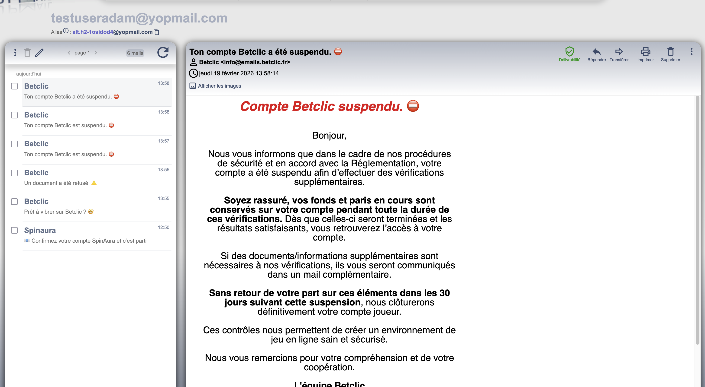

---

## Appendix: Fraudulent Clone App Discovery

During the initial phase of this assessment, a **fraudulent clone app** ("Betclic: Sports Mood", package `com.bclicrisez.utility`) was accidentally installed from the Google Play Store instead of the official Betclic app. A full investigation of this fake app, including ADB forensics and evidence, is documented in the [`fake-app-investigation/`](fake-app-investigation/part1-flow-and-ui.md) folder.

---

*Document generated as part of the QA Automation Assessment for Betclic.*
